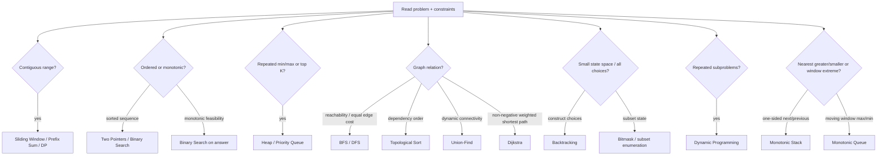

# Algorithm Selection Map

This is a **candidate generator**, not an answer flowchart. Multiple branches can be true at once.
The final choice still depends on invariants, complexity, and mutations.



## 1. Sequence questions

### Is the answer about a contiguous interval?

Candidates: sliding window, prefix sum, 1D DP.

Decision signal:

- If window validity changes predictably as boundaries move → sliding window.
- If many static range aggregate queries need subtraction → prefix sum.
- If the best answer ending at position `i` depends on previous optimal states → DP.

### Is the sequence sorted or can sorting create useful order?

Candidates: two pointers, binary search, interval sweep, greedy.

Decision signal:

- Need a pair/boundaries that move monotonically → two pointers.
- Need one target/boundary in an ordered search space → binary search.
- Need to process overlapping ranges in coordinate order → interval sweep.

## 2. Selection questions

### Do I repeatedly need the best current candidate?

Heap becomes a candidate when the set changes and you repeatedly extract min/max or maintain top K.

If you only need the minimum once, a linear scan is simpler. If you can sort once and consume all
items in order, sorting may be cleaner.

## 3. Graph questions

First identify graph shape: directed/undirected, weighted/unweighted, static/dynamic.

```text
unweighted shortest path → BFS
reachability / components → BFS or DFS
dependency ordering → topological sort
repeated union/connectivity → Union-Find
non-negative weighted shortest path → Dijkstra
```

The word “graph” does not choose the algorithm. The **query about the graph** does.

## 4. Exhaustive-choice questions

Small N plus “all combinations/permutations/configurations” raises backtracking or bitmasking.

- Need to construct choices while pruning invalid prefixes → backtracking.
- Need compact subset identity, subset iteration, or subset DP → bitmask.

## 5. Optimization questions

### Is there a locally best-looking move?

That only makes greedy a candidate. You still need a reason the local choice cannot hurt the global
optimum—often an exchange argument, cut property, ordering argument, or dominance proof.

### Do choices create overlapping future subproblems?

DP becomes a candidate. The central task is not writing a loop; it is defining:

> **What exactly does `dp[state]` mean?**

If you cannot state that in one sentence, the transition is not ready.

## 6. The final defense

Before implementing, say:

```text
I choose ______ because ______.
The invariant is ______.
The naive alternative costs / fails because ______.
If ______ changed, I would reconsider ______.
```

That sentence is the core exercise of this repository.
